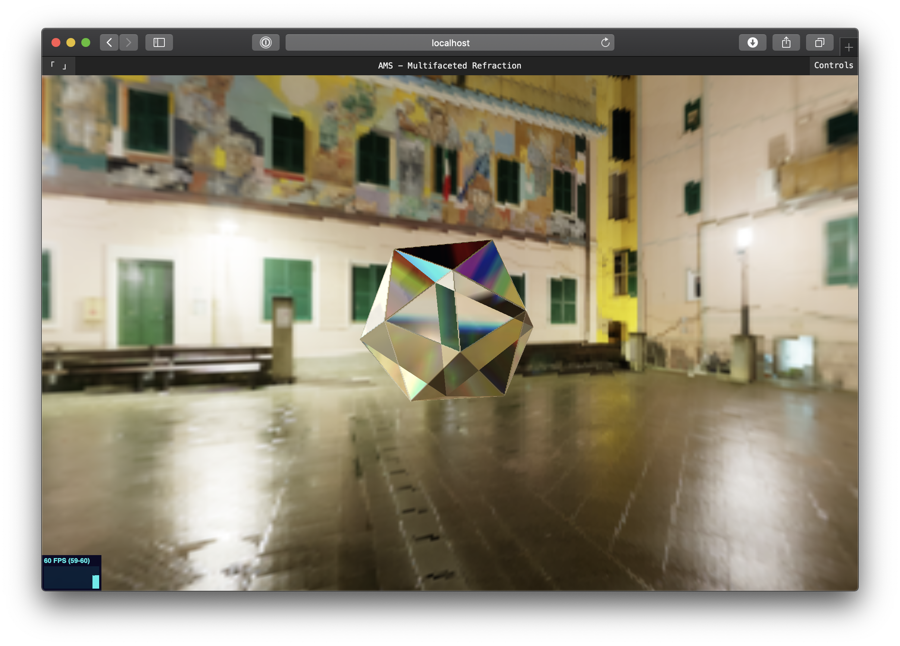

# three-multifaceted-refraction

Three.js project which explores multifaceted refraction using convex geometries, and the physical phenomena involved in it.

## References

- [Jesper Vos' Multiside Refraction Tutorial](https://tympanus.net/codrops/2019/10/29/real-time-multiside-refraction-in-three-steps/)
- [Wikipedia's Spectral Color Article](https://en.wikipedia.org/wiki/Color#Spectral_colors)
- [Learn OpenGL's PBR Theory Article](https://learnopengl.com/PBR/Theory)

## License

The code is available under the [MIT license](LICENSE)
